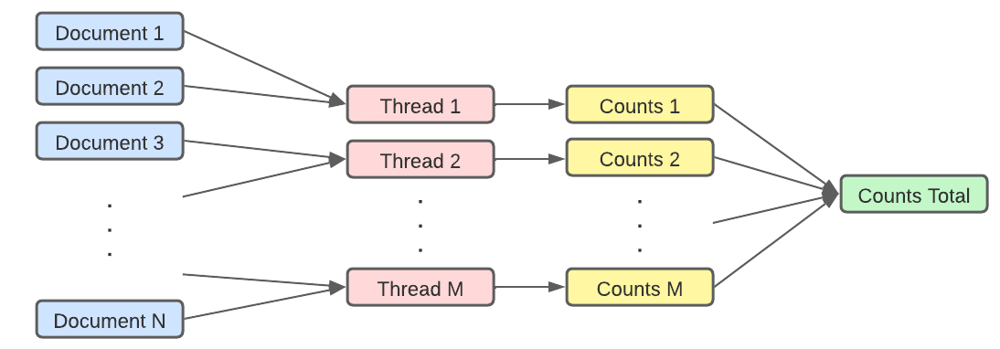

# Parallel-Computing-MapReduce
---
#### Motivation
For this assignment you will write a parallel map reduce program. The program will search for a set of words among a set of documents that constitute the works of Shakespeare. The set of words is listed below. The assignment should use the map-reduce design pattern to split up the work. You should have functions that count the number of a specific word within a specific document and combine the individual word counts.

#### Idea
Let the documents be assigned to threads seprately. This will avoid the overhead problem, in other words, each document will only be copied once by one thread and be counted.

Number of documents assigned to each file is: num_files/num_threads.

#### Program Descrition
This program contains two scripts `wordsUtils.py` and `parallelCount.py`.
- `wordsUtils.py` contains the helper functions to:
  - `getTextFileDirs` Read the text file lists with default file directory
  - `makeWordsDict` Genrate words counting dictionary with given default set of words
  - `countDocument` Count words by given file directory
- `parallelCount.py` contains parallel method which counts words in files with given list of file directories.

#### Command to run the code
```
python parallelCount.py
```

#### Result
Sample output:
```
Start Parallel
===========================
Thread 1 starts work.
Thread 2 starts work.
Thread 3 starts work.
Thread 4 starts work.
Thread 5 starts work.
Thread 0 starts work.
Thread 6 starts work.
Thread 7 starts work.
Thread 2 has done it's work on file ./documents/shakespeare1.txt
Thread 1 has done it's work on file ./documents/shakespeare3.txt
Thread 3 has done it's work on file ./documents/shakespeare4.txt
Thread 7 has done it's work on file ./documents/shakespeare8.txt
Thread 5 has done it's work on file ./documents/shakespeare7.txt
Thread 4 has done it's work on file ./documents/shakespeare5.txt
Thread 6 has done it's work on file ./documents/shakespeare6.txt
Thread 0 has done it's work on file ./documents/shakespeare2.txt
===========================

Resulting wordcounts
hate: 332
love: 3070
death: 1016
night: 1402
sleep: 470
time: 1806
henry: 661
hamlet: 475
you: 23306
my: 14203
blood: 1009
poison: 139
macbeth: 288
king: 4545
heart: 1458
honest: 434

===========================
Number of Threads: 8
Total Parallel Operation Time: 0.509950088
Total File Read Time: 0.04300667700000005
Total Words Count Time: 2.3074974860000004
===========================
```

\# of files | \# of Threads | Total Time Usage (Seconds) | Cumulative File Read Time | Cumulative Words Count Time
--- | --- | --- | --- | --- 
8 | 1 | 2.091615451 | 0.02756350599999996 | 1.978922616
8 | 2 | 1.330601013 | 0.03238631999999972 | 1.955139615 
8 | 4 | 0.77256599 | 0.03461293600000001 | 2.163536268
8 | 8 | 0.509950088 | 0.04300667700000005 | 2.3074974860000004
8 | 16 | 0.50859671 | 0.047722181999999974 | 2.296346835

#### Analysis
1. My cpu contains 8 cores.
   - When # of Threads <= 8:
     - __The increase threads usage decreases the total time usage__:
    This is because: total_time = max({threads_time_usage}). 
     As long as we use more threads, each thread will handle less amount of files. The computation time of each thread will decrease. Therefore, the maximum computation time of threads will decrease, the total time usage of our parallel program will decrease.
     - __The increase threads usage increases cumulative time usage for reading file but decreases the reading time overall__
     The increase of cumulative time usage is due to the system requires more time to allocate the distributed memory as long as there are more threads have been involved. However, the average time usage, in other words, real time usage decreases. This is because the more threads have been used make each thread take care of less number files. Reading less files make each thread spent less file reading time.
     - __The increase threads usage increases cumulative time usage for counting file but decreases the counting time overall__
     The increase of cumulative time usage is due to the system requires more time to allocate the computing resources. However, the average time usage, in other words, real time usage decreases. This is because the more threads have been used make each thread take care of less number files. Counting less files make each thread spent less file counting time.
   - When # of Threads > 8:

     Time usages are not changing. This is because our implemented threads are more than the cores numbers within CPU. Excessed number of threads will actually run as serial program.

## Result Analysis
1) What problems you encountered completing the assignment and how you overcame them?
```
A: None
```
2) Any problems you weren't able to overcome or any bugs still left in the program?
```
A: No.
```
3) About how long it took you to complete the assignment?
```
A: About 3 hours.
```

4) Any observations or comments you had while doing the assignment?
```
A: None
```
5) Output from the cpuInfoDump.sh program
```
I'm doing this homework by using my own computer, therefore I used different bash commands. The returned results:
Intel(R) Core(TM) i9-9980HK CPU @ 2.40GHz
physicalcpu: 8
logicalcpu: 16
```

#### Developer
Sammy (Siyu) Deng
